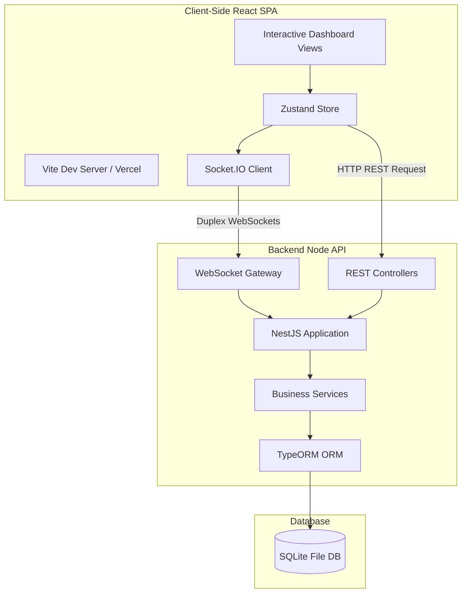

# 🌐 Waypoint: Conference Operating System

Waypoint is a premium, outcome-driven, real-time conference operating system designed to elevate professional networking. Instead of simple badge scans and passive attendance, Waypoint centers on outcome-driven profiles, AI-powered matchmaking twins, real-time occupant presence tracking, and a comprehensive Organizer Studio (Mission Control) to manage the entire event space.

---

## 📐 Architecture & System Flow

Waypoint uses a split monorepo-style architecture. The frontend is a lightweight Single Page Application (SPA) communicating with a stateful NestJS backend via REST APIs and persistent WebSocket connections.



---

## ⚡ Key Features

1. **🏢 Conference Operating Wizard (Multi-Tenant Hub)**
   * A premium, 7-step wizard to register new event tenants, configure custom branding themes, dates, timezone, permissions, custom zones, and security policies.

2. **🤖 Onboarding & AI Matchmaker Twin**
   * Multi-step participant profiles with custom visual badge selections.
   * "AI Twin" builder analyzing attendee goals and skills to generate match summaries and networking intent cards.

3. **📡 Real-Time Presence & Networking**
   * Live check-ins across physical venue zones.
   * One-tap match connections powered by Socket.IO with automated real-time toast alert dispatches.

4. **📊 Organizer Mission Control Dashboard**
   * **Live Capacity Tracking**: Dynamic horizontal occupancy meters showing check-ins against max room capacity.
   * **Role Distributions**: SVG Donut Chart showing active attendee and staff breakdowns.
   * **Moderation Hub**: Custom tabular listings of active sessions, RBAC permissions, and active users (with demote/suspend controls).
   * **Audit Log**: Immutable ledger of administrative and moderator actions.

---

## 🛠️ Technology Stack

| Layer | Technology | Key Libraries |
| :--- | :--- | :--- |
| **Frontend** | React 18, TypeScript, Vite | Zustand (State), Socket.IO Client, Lucide React (Icons) |
| **Backend** | NestJS 10, TypeScript | Socket.IO Server, TypeORM, SQL-Lite |
| **Styles & Themes** | Vanilla CSS | Custom CSS CSS-in-JS Tokens (OLED Dark Mode) |

---

## 📂 Repository Structure

```
waypoint-new/
├── client/                 # React + Vite Client Application
│   ├── src/                # Component & Page Views
│   │   ├── api/            # API Call Client Wrapper
│   │   ├── components/     # Reusable UI Widgets & Icons
│   │   ├── pages/          # Core views (Landing, Onboarding, Organizer, Dashboard)
│   │   └── store/          # Zustand State & Websockets Client
│   ├── vercel.json         # SPA router redirects for Vercel
│   └── tsconfig.json       # Client compiler options
│
├── server/                 # NestJS Server Application
│   ├── src/                # Controllers, Gateways, Services, and DB Entities
│   └── tsconfig.json       # Server compiler options
│
└── package.json            # Workspace orchestration scripts
```

---

## 🚀 Getting Started

### 1. Installation
Run the root helper command to install dependencies for both directories:
```bash
npm run install-all
```

### 2. Local Environment Setup
Define your environment variables in `.env` files within each directory:

* **`client/.env`**:
  ```env
  VITE_API_URL=http://localhost:3001
  ```
* **`server/.env`**:
  ```env
  PORT=3001
  ```

### 3. Launching Development Servers
Run the client and server concurrently using the workspace scripts:

* **Start Backend Server (NestJS)**:
  ```bash
  npm run start:server
  ```
* **Start Frontend Client (Vite)**:
  ```bash
  npm run start:client
  ```

---

## 🎨 Design System & Visual Tokens
Waypoint runs on a bespoke design system optimized for dark-mode interfaces (inspired by Vercel & Linear). CSS variables located in `client/src/index.css` govern all UI element borders, surfaces, card elevation, and glows. Third-party UI frameworks have been completely purged to ensure zero dependencies, maximum rendering speed, and custom visual consistency.
